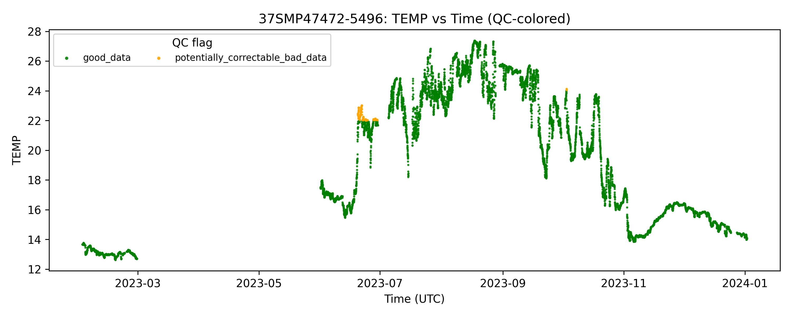
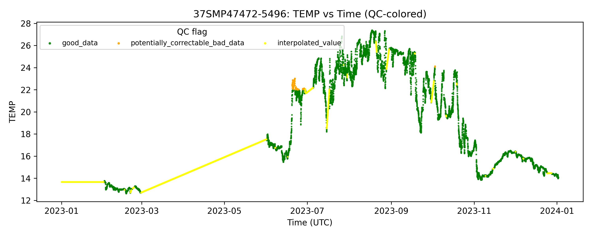

# CTD NetCDF Gap Filling
This repository provides a complete pipeline to interpolate and visualize NetCDF time-series 
data from the OBSEA CTD dataset.

## Table of Contents
- [Project structure](#project-structure)
- [Description](#description)
  - [Input data](#input)
  - [Output data](#output)
  - [Visual example](#visual-example)
- [Setup](#setup)
- [Usage](#usage)


## Project Structure
- `images/`: Directory containing the images included in this README.
- `get_filled_netcdf.py`: The main processing script.
- `requirements.txt`: List of Python dependencies required for the project.
- `README.md`: Project description and setup instructions.


## Description
This software processes time-series NetCDF files containing oceanographic measurements (e.g. temperature, 
salinity, pressure) that may contain temporal gaps or irregular coverage.

Given a specified time range, the pipeline:

1. Downloads a NetCDF file from ERDDAP containing all available data within the specified time range
2. Extends the TIME axis to fully span the requested period
3. Interpolates missing values for each sensor and variable
4. Updates QC flags consistently
5. Generates optional QC-colored diagnostic plots

All original dimensions, variables, attributes, and conventions are preserved. Some metadata
fields are updated accordingly.

### Input
The time range to be processed is specified using ```start date``` and ```end date```.


### Output
The pipeline produces:

1. One gap-filled NetCDF file.
2. Optionally, the raw dataset downloaded from ERDDAP used for interpolation.
3. Optional QC-colored PNG plots for each variable and sensor.

Interpolated values are clearly marked using QC flags (‘interpolated_value’).


### Visual example
Example of raw ERDDAP data, containing gaps:

<table>
  <tr>
    <td></td>
  </tr>
  <tr>
    <td align="center">
      <b>Original temperature data as stored in ERDDAP (with gaps)</b>
    </td>
  </tr>
</table>

And corresponding script output:

<table>
  <tr>
    <td></td>
  </tr>
  <tr>
    <td align="center">
      <b>Temperature data after gap filling and interpolation</b>
    </td>
  </tr>
</table>


## Setup
1. Clone the repository:
```
git clone https://github.com/sandracoronis/fill-obsea-ctd.git
cd fill-obsea-ctd
```
2. Create and activate a new virtual environment:
```
conda create -n netcdf-fill python=3.12

conda activate netcdf-fill
```
3. Install dependencies:
```
pip install -r requirements.txt
```

## Usage
The program is used as follows:

```
usage: get_filled_netcdf.py [-h] --start START --end END -o OUTPUT [-p] [-k] [-v]

OBSEA_CTD_30min NetCDF file interpolator

options:
  -h, --help                    Show this help message and exit
  --start START                 Start date to be processed (YYYYMMDD)
  --end END                     End date to be processed (YYYYMMDD)
  -o OUTPUT, --output OUTPUT    Name of the output folder where the interpolated NetCDF file will be stored
  -p, --plot                    Plot results
  -k, --keep                    Keep raw data used for gap filling
  -v, --verbose                 Verbose output
```

Below is an example code snippet to demonstrate how to run the main script:
```
python get_filled_netcdf.py --start 20230101 --end 20240101 -o /path/to/store/results -p
```