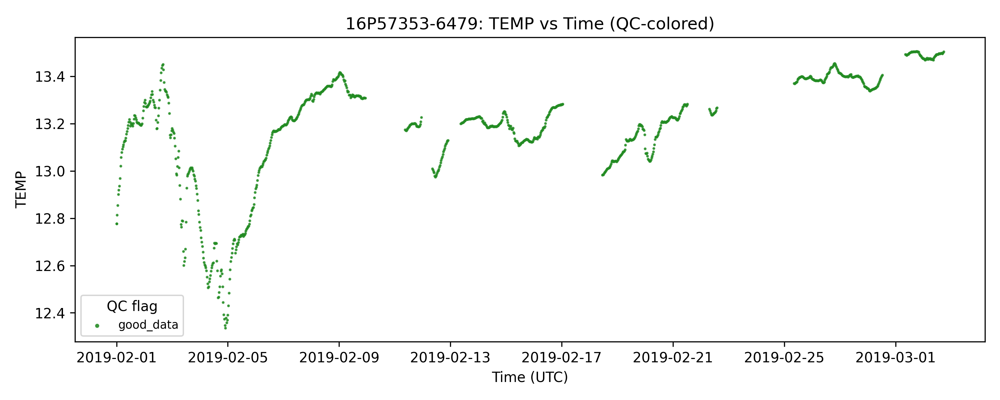
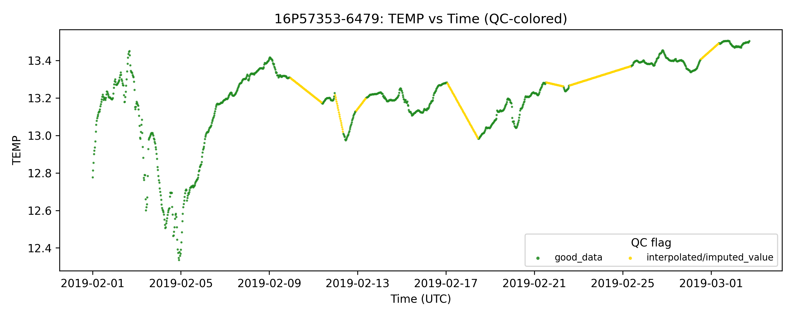
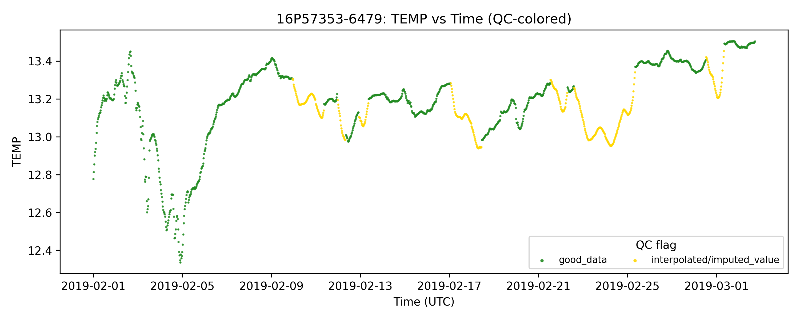

# CTD NetCDF Gap Filling

Pipeline to download, gap-fill, and visualize NetCDF time-series data from the OBSEA CTD dataset.

## Table of Contents
- [Project structure](#project-structure)
- [Description](#description)
  - [Gap filling strategy](#gap-filling-strategy)
  - [Input](#input)
  - [Output](#output)
  - [QC flags](#qc-flags)
  - [Visual example](#visual-example)
- [Setup](#setup)
- [Usage](#usage)
  - [Arguments](#arguments)
  - [Examples](#examples)


## Project Structure

```
fill-obsea-ctd/
├── get_filled_netcdf.py        # Main processing script
├── models.py                   # Neural model architectures (GRU, SAITS, BRITS, ResGRU)
├── model/                      # Default model checkpoint directory
│   ├── best_model.pt           # Trained model weights
│   ├── config.json             # Model architecture config
│   ├── mu.npy / std.npy        # Normalisation statistics
│   └── cmems_climatology.json  # CMEMS day-of-year climatology
├── images/                     # Images used in this README
├── Dockerfile
├── requirements.txt
└── README.md
```


## Description

Given a time range (or a single timestamp), the pipeline:

1. Downloads the requested interval from the OBSEA ERDDAP server
2. Fills all temporal gaps using the selected strategy (neural model or linear interpolation)
3. Writes a gap-filled NetCDF file
4. Optionally generates QC-colored diagnostic plots

If ERDDAP returns no data for the requested interval, the script falls back to running the
model on an all-NaN series (filled entirely from climatology) and writes the result with QC=8.

### Gap filling strategy

Gaps are filled using a **three-priority pipeline** applied independently to each sensor:

| Priority | Source | Condition |
|----------|--------|-----------|
| 1 | Sensor's own observed value | QC flag in `--valid-qc` |
| 2 | Value borrowed from another sensor | QC flag in `--valid-qc` |
| 3 | Neural model prediction or linear interpolation | Applied where no sensor had valid data |

**Neural model** (used when `--ckpt` is provided): a trained model encodes climatological
anomalies over a sliding context window. The model always uses QC∈{1, 7} internally,
regardless of `--valid-qc`.

**Linear interpolation** (fallback when no checkpoint is given): interior gaps are filled
by linear interpolation between the two nearest observed values; leading/trailing gaps are
filled by propagating the nearest value outward.

### Input

| Mode | Arguments | Description |
|------|-----------|-------------|
| Date range | `--start`, `--end` | Process a multi-day interval |
| Single timestamp | `--time` | Process one day up to the given timestamp |


### Output

| File | Description |
|------|-------------|
| `<dataset>_<start>_<end>.nc` | Gap-filled NetCDF |
| `<dataset>_<start>_<end>_raw.nc` | Raw ERDDAP download (only with `-k`) |
| `plots/*.png` | QC-colored scatter plots per variable (only with `-p`) |

The output format is controlled by `--save-mode`:

- **`all-sensors`** (default): one row per sensor per timestamp, one block per sensor covering the full time range.
- **`one-timestamp`**: one row per timestamp (the best available value wins). The `sensor_id`
  field records the source sensor, or `'model'` for imputed values.

### QC flags

| Flag | Meaning |
|------|---------|
| 1 | good_data |
| 2 | probably_good_data |
| 3 | potentially_correctable_bad_data |
| 4 | bad_data |
| 7 | nominal_value |
| 8 | interpolated / imputed value |
| 9 | missing_value |

Values from the original ERDDAP file are kept with their original QC flag when the flag is
in `--valid-qc` (default: 1 and 7). All other positions receive QC=8 (imputed).

### Visual example

Example of raw ERDDAP data containing gaps:

<table>
  <tr>
    <td></td>
  </tr>
  <tr>
    <td align="center"><b>Original temperature data as stored in ERDDAP (with gaps)</b></td>
  </tr>
</table>

Corresponding script output after gap filling:

<table>
  <tr>
    <td></td>
  </tr>
  <tr>
    <td align="center"><b>Temperature data after gap filling by linear interpolation</b></td>
  </tr>
</table>

<table>
  <tr>
    <td></td>
  </tr>
  <tr>
    <td align="center"><b>Temperature data after gap filling by imputation model</b></td>
  </tr>
</table>


## Setup

Clone the repository:
```bash
git clone https://github.com/sandracoronis/fill-obsea-ctd.git
cd fill-obsea-ctd
```

### Option 1: Virtual environment
1. Create and activate a virtual environment:
```bash
conda create -n netcdf-fill python=3.10
conda activate netcdf-fill
```

2. Install dependencies:
```bash
pip install -r requirements.txt
```

### Option 2: Docker
1. Create a docker image:
```bash
docker build -f Dockerfile -t netcdf-fill .
```
2. Run a docker container:
```bash
docker run -v /path/to/results:/output netcdf-fill \
    --start 20240101 --end 20240201 --ckpt model/best_model.pt --out /output -p
```

## Usage

### Arguments

```
usage: get_filled_netcdf.py [-h] [--start START] [--end END] [--time TIME]
                             [--ckpt CKPT] [--out OUT]
                             [--save-mode {one-timestamp,all-sensors}]
                             [--valid-qc QC [QC ...]] [-p] [-k]

OBSEA_CTD_30min NetCDF gap filler

options:
  -h, --help            Show this help message and exit

Time range:
  --start START         Start date (YYYYMMDD). Used when --time is not given.
                        Default: 20230101
  --end END             End date (YYYYMMDD). Used when --time is not given.
                        Default: 20240101
  --time TIME           Single timepoint to process (YYYYMMDD-hh:mm or 'now').
                        The filled NC file and plots span from 00:00 of that day
                        to the given timestamp. A wider context window is downloaded
                        automatically for the model but excluded from the output.

Model:
  --ckpt CKPT           Path to the neural model checkpoint (.pt file).
                        The climatology (cmems_climatology.json), configuration
                        (config.json) and normalization (mu.npy and std.npy) files 
                        are expected in the same directory as the checkpoint.
                        If not provided, linear interpolation is used.

Output:
  --out OUT             Output directory. Default: results/
  --save-mode {one-timestamp,all-sensors}
                        Output format for the filled NetCDF file.
                        one-timestamp: one row per timestamp (best sensor wins).
                        all-sensors: one row per sensor per timestamp (default).
  --valid-qc QC [QC ...]
                        QC flag values treated as valid in the original file.
                        Values with other flags are replaced by imputed data (QC=8).
                        Default: 1 7
  -p, --plot            Generate QC-colored scatter plots.
  -k, --keep            Keep the raw ERDDAP download on disk.
```

### Examples

Process a date range using linear interpolation:
```bash
python get_filled_netcdf.py --start 20230101 --end 20240101 --out results/ -p
```

Process a date range with the neural model:
```bash
python get_filled_netcdf.py --start 20230101 --end 20240101 --ckpt model/best_model.pt --out results/ -p
```

Process up to the current timestamp (DTO-feeding mode):
```bash
python get_filled_netcdf.py --time now --ckpt model/best_model.pt --out results/ -p
```

Process up to a specific timestamp:
```bash
python get_filled_netcdf.py --time 20240325-17:30 --ckpt model/best_model.pt --out results/
```

Use one-timestamp output mode, keeping QC={1,2,3,7} values from the original:
```bash
python get_filled_netcdf.py --start 20230101 --end 20240101 --save-mode one-timestamp --valid-qc 1 2 3 7 --out results/ -p
```
